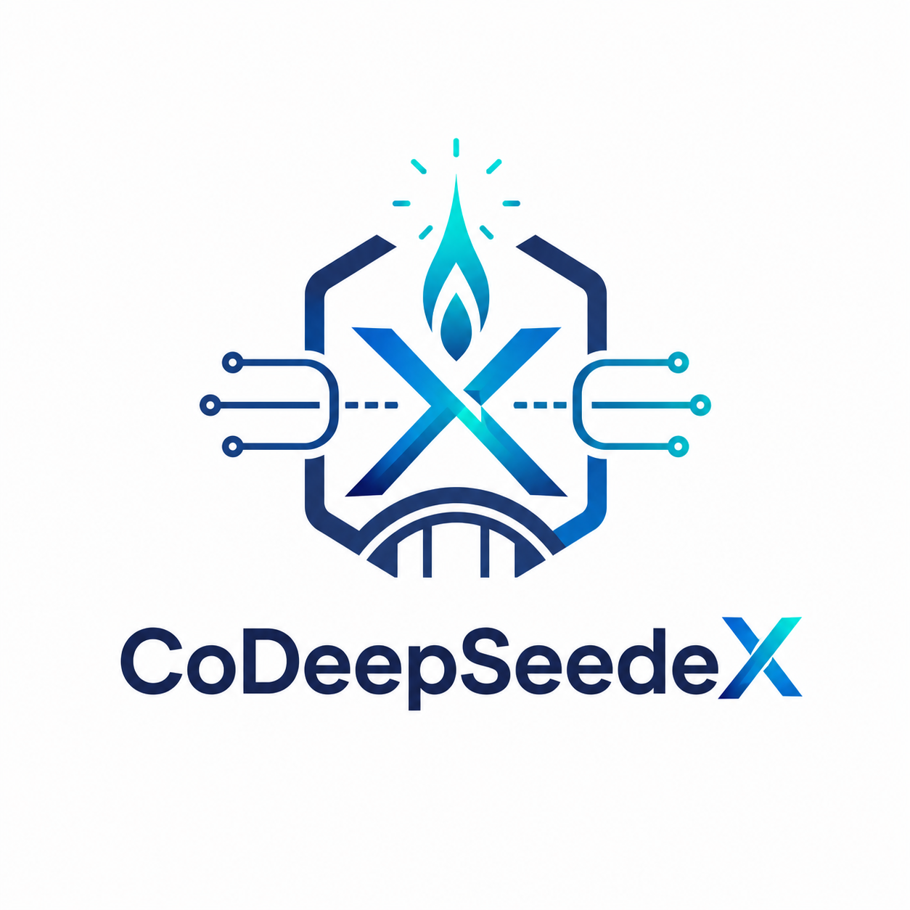

# CoDeepSeedeX

[中文说明](README.zh-CN.md) | English

<!-- CODEEPSEEDEX_LOGO_START -->
<p align="center">
  
</p>
<!-- CODEEPSEEDEX_LOGO_END -->

Local OpenAI Responses-compatible proxy for running Codex with DeepSeek models.

## ✅ Prerequisites

Before installing CoDeepSeedeX, make sure the OpenAI Codex CLI is already installed and the `codex` command is available on your `PATH`.

    codex --version

If Codex CLI is not installed yet, install it first:

    npm install -g @openai/codex

Then run the CoDeepSeedeX installer.

## ⚡ One-line install

    curl -fsSL https://github.com/Awenforever/CoDeepSeedeX/releases/latest/download/bootstrap.sh | bash

### Fallback install command

If the GitHub Release asset, `raw.githubusercontent.com`, or a CDN mirror is unstable or blocked, use the fallback downloader:

```bash
tmp="$(mktemp -d)"
bs="$tmp/bootstrap.sh"
(
  curl -fL --retry 5 --retry-all-errors --retry-delay 3 https://github.com/Awenforever/CoDeepSeedeX/releases/latest/download/bootstrap.sh -o "$bs" ||
  curl -fL --retry 5 --retry-all-errors --retry-delay 3 https://raw.githubusercontent.com/Awenforever/CoDeepSeedeX/${tag}/bootstrap.sh -o "$bs" ||
  curl -fL --retry 5 --retry-all-errors --retry-delay 3 https://github.com/Awenforever/CoDeepSeedeX/raw/refs/tags/${tag}/bootstrap.sh -o "$bs" ||
  curl -fL --retry 5 --retry-all-errors --retry-delay 3 https://cdn.jsdelivr.net/gh/Awenforever/CoDeepSeedeX@${tag}/bootstrap.sh -o "$bs" ||
  curl -fL --retry 5 --retry-all-errors --retry-delay 3 https://fastly.jsdelivr.net/gh/Awenforever/CoDeepSeedeX@${tag}/bootstrap.sh -o "$bs"
) && bash "$bs"
```

The installer will:

- install CoDeepSeedeX into `~/.local/share/deepseek-responses-proxy`
- create the `dsproxy` command
- create two Codex profiles: `deepseek` and `deepseek-thinking`
- optionally install a safe `codex` wrapper for these two profiles only
- ask for stable/thinking ports
- open a guided API configuration menu for the model API, optional web search providers, and optional image generation providers
- ask you to paste each API key at the corresponding hidden prompt
- validate configured API keys before saving them, unless you skip validation or skip that provider
- save validated API keys in a local `chmod 600` env file

- modify user-level Codex/profile files only in your current user account

When the installer or `dsproxy config wizard` asks for an API key, paste the key directly at that prompt and press Enter. Hidden input means the key will not appear on screen while you type or paste it. This is local permission-based storage, not cryptographic encryption. Failed validation does not save the key, and the guided menu can be skipped so keys can be configured later.

The bootstrap script installs missing apt-based prerequisites when needed, including `git`, `curl`, `ca-certificates`, and a Python 3.11+ interpreter for the installer.

## ⬆️ Upgrade

**Users on versions earlier than `v0.3.3-alpha` are strongly encouraged to run the `curl` installer command once. After that, `dsproxy upgrade` can handle seamless updates.**

CoDeepSeedeX supports two compatible upgrade paths.

### Path A: `dsproxy upgrade`

Use this when your installed version already includes the `upgrade` command:

```bash
dsproxy upgrade
```

Preview first:

```bash
dsproxy upgrade --dry-run
```

By default, `dsproxy upgrade` resolves the GitHub Latest Release tag and checks out that controlled release, reinstalls the package, refreshes the `deepseek` and `deepseek-thinking` Codex profiles, restarts the local proxies, and opens the guided API configuration wizard when model, web search, or image generation API keys are still missing. The wizard can be skipped.

If you intentionally need a fixed release or branch, pass an explicit ref:

```bash
dsproxy upgrade --tag <tag-or-branch>
```

### Path B: rerun the one-line installer

Use this when upgrading from older releases such as `v0.1.0-alpha`, or when `dsproxy upgrade` is not available:

```bash
curl -fsSL https://github.com/Awenforever/CoDeepSeedeX/releases/latest/download/bootstrap.sh | bash
```

This path is intentionally compatible with Path A. The bootstrap entrypoint fetches the current Release installer, refreshes the installation and profiles, and preserves local env and Codex configuration by default.

Verify after either path:

```bash
dsproxy --version
dsproxy doctor --thinking
curl -sS http://127.0.0.1:8000/healthz
curl -sS http://127.0.0.1:8001/healthz
```


### API key and model metadata

There are three different configuration layers:

1. The model API key is required for Codex to talk to the upstream model provider through CoDeepSeedeX.
2. Web search API keys are optional. Configure one only if you want Codex tool calls to use web search.
3. Image generation API keys are optional. Configure one only if you want Codex tool calls to generate images.

The installer and `dsproxy config wizard` validate API keys before saving them in the local env file, by default `~/.config/deepseek-responses-proxy/env`, with restricted file permissions. When a command asks for a key, paste it at the hidden `API key:` prompt and press Enter. The key is not printed back to the terminal.

Common commands:

```bash
# Show saved provider settings. Secret values remain hidden.
dsproxy config show

# Open the guided menu. Use this if you are not sure which provider to configure.
dsproxy config wizard

# Configure the model API provider used by Codex itself.
dsproxy config set-model --provider deepseek
dsproxy config set-model --provider kimi
dsproxy config set-model --provider zhipu
dsproxy config set-model --provider zhipu-coding
dsproxy config set-model --provider zai
dsproxy config set-model --provider zai-coding
dsproxy config set-model --provider qwen-beijing
dsproxy config set-model --provider qwen-singapore
dsproxy config set-model --provider qwen-us
dsproxy config set-model provider-model-name --provider custom --base-url https://api.example.com/v1 --skip-validation

# Test the currently configured model API key.
dsproxy config test-api-key

# Configure optional web search tool providers.
dsproxy config set-web-search-api-key --provider serpapi
dsproxy config set-web-search-api-key --provider tavily
dsproxy config set-web-search-api-key --provider exa
dsproxy config set-web-search-api-key --provider firecrawl

Brave Search is no longer shown in the guided configuration flow because API key creation requires a paid subscription and there is no free live-probe path.

# Configure optional image generation tool providers.
dsproxy config set-image-api-key --provider zhipu
dsproxy config set-image-api-key --provider zai
dsproxy config set-image-api-key --provider qwen_image
dsproxy config set-image-api-key --provider stability
dsproxy config set-image-api-key --provider fal
```

Add `--skip-validation` only when you intentionally want to save the key without a live provider check, for example when you are offline, the provider validation endpoint is temporarily unavailable, or you are configuring a custom provider that cannot be validated automatically:

```bash
dsproxy config set-model provider-model-name --provider custom --base-url https://api.example.com/v1 --skip-validation
dsproxy config set-web-search-api-key --provider serpapi --skip-validation
dsproxy config set-image-api-key --provider zhipu --skip-validation
```

API key input examples with fake values:

```bash
# Recommended interactive form. Paste the real key into the hidden prompt after running the command.
dsproxy config set-model --provider deepseek
# Prompt shown by the command:
# DeepSeek API key: <paste-your-real-key-here; input is hidden>

# Non-interactive examples. The key must be passed with --value, not as a positional argument.
# Prefer fake values in documentation and avoid putting real keys in shell history.
dsproxy config set-model --provider deepseek --value sk-fake-deepseek-api-key
dsproxy config set-web-search-api-key --provider serpapi --value fake-serpapi-api-key
dsproxy config set-image-api-key --provider zhipu --value fake-zhipu-api-key

# Custom model provider example.
dsproxy config set-model provider-model-name --provider custom --base-url https://api.example.com/v1 --value sk-fake-custom-api-key --skip-validation
```

The installer also connects that env file and the `dsproxy` wrapper directory to your shell profile so new terminals can find `dsproxy` and Codex can see the configured model API key. If the current shell still cannot find `dsproxy`, open a new terminal or source the shell profile printed by the installer.


### Provider access quick reference

CoDeepSeedeX keeps provider setup lightweight. Free quotas, trial credits, and rate limits change often, so check each provider's official pricing or credits page before using it. Web search and image generation are separate from the model API: the model API powers Codex answers, while these optional providers power tool calls when Codex needs current web results or generated images. Web search key validation uses a fixed low-result query and may consume a minimal search quota. Image key validation avoids image generation where possible: Stability uses an account-balance probe, fal.ai uses a model-metadata probe, and Zhipu/Z.AI plus Qwen/DashScope use a non-generation authentication probe. If validation fails, the key is not saved unless you explicitly pass `--skip-validation`.

#### Model API provider quick reference

Use explicit site and plan names for model API setup. Do not use the old `glm` or `qwen` shortcut in documentation because it hides the endpoint choice.

| Model API path | Current status | Configure |
| --- | --- | --- |
| DeepSeek | Existing primary path | `dsproxy config set-model --provider deepseek` |
| Kimi / Moonshot | Endpoint reachable, supplied key returned HTTP 401 during live validation | `dsproxy config set-model --provider kimi` |
| Zhipu / BigModel domestic general | `/models` verified | `dsproxy config set-model --provider zhipu` |
| Zhipu / BigModel domestic Coding Plan | `/models` verified, keep it separate from the general endpoint | `dsproxy config set-model --provider zhipu-coding` |
| Z.AI international general | `/models` verified | `dsproxy config set-model --provider zai` |
| Z.AI international Coding Plan | `/models` verified, keep it separate from the general endpoint | `dsproxy config set-model --provider zai-coding` |
| Qwen / DashScope Beijing pay-as-you-go | `/models` verified | `dsproxy config set-model --provider qwen-beijing` |
| Qwen / DashScope Singapore pay-as-you-go | `/models` verified | `dsproxy config set-model --provider qwen-singapore` |
| Qwen / DashScope US Virginia pay-as-you-go | `/models` verified | `dsproxy config set-model --provider qwen-us` |
| Qwen Coding Plan / Token Plan | Not script-tested because these are plan-specific tool paths | Configure as `custom` only when validating the corresponding tool path, for example `dsproxy config set-model qwen3-coder-plus --provider custom --base-url https://coding-intl.dashscope.aliyuncs.com/v1 --skip-validation` |

| Tool | Supported provider | Configure | Apply / quota page |
| --- | --- | --- | --- |
| Web search | SerpAPI | `dsproxy config set-web-search-api-key --provider serpapi` | https://serpapi.com/pricing |
| Web search | Tavily | `dsproxy config set-web-search-api-key --provider tavily` | https://docs.tavily.com/documentation/api-credits |
| Web search | Exa | `dsproxy config set-web-search-api-key --provider exa` | https://exa.ai/ |
| Web search | Firecrawl | `dsproxy config set-web-search-api-key --provider firecrawl` | https://www.firecrawl.dev/ |
| Image generation | ZhipuAI / BigModel (domestic CogView) | `dsproxy config set-image-api-key --provider zhipu` | https://www.bigmodel.cn/ |
| Image generation | Z.AI / CogView (international) | `dsproxy config set-image-api-key --provider zai` | https://docs.z.ai/ |
| Image generation | Qwen Image / DashScope | `dsproxy config set-image-api-key --provider qwen_image` | https://help.aliyun.com/zh/model-studio/qwen-image-api |

For regional DashScope endpoints, set `DEEPSEEK_PROXY_IMAGE_BASE_URL` to the target region's multimodal generation endpoint before running `dsproxy doctor providers --kind image --provider qwen_image --live --allow-spend`. This is required because DashScope API keys and service domains are region-scoped.
| Image generation | Stability AI | `dsproxy config set-image-api-key --provider stability` | https://platform.stability.ai/ |
| Image generation | fal.ai | `dsproxy config set-image-api-key --provider fal` | https://fal.ai/ |

For custom tool servers, choose `Other` in the guided menu and ask your agent to read `docs/developer-handbook.zh-CN.md`. See `docs/developer-handbook.zh-CN.md` for the handoff checklist.

Provider diagnostics:

```bash
# Check whether provider keys are configured without calling external APIs.
dsproxy doctor providers

# Run a real low-result web search probe. This may consume provider search quota.
dsproxy doctor providers --kind web-search --provider serpapi --live --allow-spend

# Run a real image generation probe. This creates a test image and may consume credits.
dsproxy doctor providers --kind image --provider zhipu --live --allow-spend
```


## Behavior changes

Release notes must mention milestone behavior changes, but the README also keeps this compact behavior-change table for changes that permanently alter CLI behavior or user workflow.

| Version | Area | Previous behavior | New behavior | Migration note |
|---|---|---|---|---|


| unreleased / p2.10a20 | Installer secret prompt and wrapper help | Pressing Enter on an existing model API key reused the hidden default and reported it as newly entered characters. Secret prompt helper text and wrapper usage guidance were not visually clear. | Secret prompt helper text is dimmed. Empty input with an existing key keeps the key without re-counting or re-validating it. The installer now explains that the Codex wrapper enables `codex --profile deepseek` and `codex --profile deepseek-thinking` with automatic local dsproxy backend handling. | Rebuild `v0.3.8-alpha` pre-release assets before VM retest. |
| unreleased / p2.10a19 | Installer menu selected-row column alignment | Selected menu rows used `▶ ` while unselected rows used a wider blank prefix, making the selected option visually shift left. | Align selected and unselected value columns by using a two-space blank prefix for unselected rows. | Rebuild `v0.3.8-alpha` pre-release assets before VM retest. |
| unreleased / p2.10a18 | Minimal arrow-only installer UI | The p2.10a17 installer accidentally kept a duplicate old menu function, so the old numeric/text fallback renderer still overrode the polished renderer in VM runs. | Duplicate menu definitions are removed. Menus now use only ↑/↓ or j/k, Enter, and Backspace. Helper text is dim and shown once. Port default hints are dim. Bootstrap no longer prints duplicate Python/installer-ready lines. | Rebuild `v0.3.8-alpha` pre-release assets before VM retest. |
| unreleased / p2.10a17 | Installer menu rendering and layout polish | Arrow-key menus could leave duplicated lines when long options wrapped, numeric shortcut `0` was not direct, and adjacent configuration messages were visually crowded. | Menu rows now truncate to terminal width, selected rows use full-row reverse-video highlight, listed numbers select immediately, the help hint is shown once, and guided sections are separated by blank lines. | Rebuild `v0.3.8-alpha` pre-release assets before VM retest. |
| unreleased / p2.10a16 | Installer logo heredoc runtime fix | p2.10a15 put the ASCII logo in an unquoted heredoc. The backtick in the logo triggered shell command substitution at runtime. | The logo art now uses quoted heredocs and prints the version line separately. A runtime logo smoke test prevents `bash -n` from missing this class of bug. | Rebuild `v0.3.8-alpha` pre-release assets before VM retest. |
| unreleased / p2.10a15 | Installer provider flow and source archive fallback | Provider menus were too flat, Yes/No entries inherited provider status labels, logo version was missing, and Git fetch failures could abort VM installs even after release assets downloaded. | Installer menus now use provider-family then endpoint/region submenus, Yes/No entries are plain, logo shows the install ref, key entry reports character count, and git setup can fall back to a tagged source archive. | Rebuild `v0.3.8-alpha` pre-release assets before VM retest. |
| unreleased / p2.10a14 | Installer source logging variable fix | p2.10a13 moved source details from the UI to logs but wrote them to `LOG_FILE`, which is not defined in the installer. | Source details now write to `INSTALL_LOG`, and tests assert the installer has no `LOG_FILE` reference. | Rebuild `v0.3.8-alpha` pre-release assets before VM retest. |
| unreleased / p2.10a13 | Installer UI compaction and TTY menu routing | Bootstrap/install screens printed full source URLs and arrow menus fell back when stdout was captured by logs. | Interactive screens now keep only the compact version label near the logo, write source details to logs, and render arrow menus through `/dev/tty`. | Rebuild `v0.3.8-alpha` pre-release assets before VM retest. |
| unreleased / p2.10a12 | Bootstrap install-ref release asset resolution | `bootstrap.sh --install-ref v0.3.8-alpha` still downloaded the Latest `install.sh` first, so pre-release fresh VM tests could enter an older installer. | Bootstrap now consumes `--install-ref`, prefers the matching release-asset `install.sh`, and prints bootstrap/installer source information under the banner. | Rebuild `v0.3.8-alpha` pre-release assets before VM retest. |
| unreleased / p2.10a11 | Model provider support labels | Non-DeepSeek model providers were labeled Supported even though only API connectivity had been verified. | Only DeepSeek remains Supported. Kimi, Zhipu / BigModel, Z.AI, and Qwen / DashScope model providers are now labeled Experimental until full Codex workflow validation passes. | This is a classification and UX correction only. |
| unreleased / p2.10a10 | Installer provider selection UI | Installer provider menus relied on number input and some image-provider hints still used generic Qwen names. | Guided installer menus now prefer arrow-key selection with numeric/text fallback, and image-provider hints use explicit Qwen region names. | This changes installer UX only; no Release tag is moved. |
| v0.3.8-alpha / p2.10a8 | Alpha upgrade channel and Codex tab title | `dsproxy upgrade` only followed GitHub Latest Release, and the Codex wrapper did not set the terminal tab title. | `dsproxy upgrade --alpha` now follows the newest non-draft GitHub pre-release, while default `dsproxy upgrade` still follows Latest Release. The Codex wrapper randomizes the tab title as `[emoji]CoDeepSeedeX` for `deepseek` and `deepseek-thinking` profiles. | Use `dsproxy upgrade --alpha` for VM pre-release validation. After validation, mark that GitHub pre-release as Latest. |
| v0.3.8-alpha / p2.10a6 | Installer model API guided setup | The installer grouped model providers under ambiguous choices such as `GLM / Z.AI` or generic `Qwen / DashScope`, and still exposed custom-endpoint-only options such as Mimo and Baichuan as guided choices. | The installer now mirrors the explicit model provider surface: Zhipu / BigModel domestic general, Zhipu / BigModel domestic Coding Plan, Z.AI international general, Z.AI international Coding Plan, and Qwen / DashScope Beijing, Singapore, and US Virginia pay-as-you-go. | Re-run the installer only if you rely on guided model API setup. Existing CLI configuration remains compatible. Legacy `glm` and `qwen` shortcuts remain backward aliases but are not public recommendations. |
| v0.3.8-alpha / p2.10a4 | Model API configuration commands | `set-api-key` was the primary model API setup command, while `set-model` only changed the current upstream model. | `set-model` is now the primary model provider, model, and optional API key setup command. `set-api-key` remains as a compatibility alias with a deprecation note. | Prefer `dsproxy config set-model --provider <provider>` for model API setup. Existing `set-api-key` scripts can continue to run during the compatibility period. |
| unreleased / p2.10a3 | Provider validation and Qwen Image regions | Non-generation image validation could classify HTTP 200 provider error bodies as generic validation failures. Qwen Image appeared as one generic DashScope option. | HTTP 200 provider error bodies are accepted as non-generation auth/account probes when no auth error is present. Qwen Image now lists Beijing and Singapore as supported choices and US Virginia/Germany Frankfurt as model-unavailable choices. | Re-run `dsproxy config set-image-api-key` with `qwen_image_beijing` or `qwen_image_singapore` when using Qwen Image. |
| unreleased / p2.10a2 | Config apply and reasoning effort | API key/model/effort changes were saved, but users had to infer whether running proxies needed a restart. `medium` could appear in user-facing effort examples even though the DeepSeek proxy path normalizes it to `high`. | Successful config writes refresh already-running local stable/thinking proxies and report `all updates applied`. User-facing effort guidance uses `high`, while `low`/`medium` remain accepted compatibility inputs and are stored as `high`. | Rerun the installer or run `dsproxy config set-effort high` to refresh installed Codex profile wording. |

## 🚀 Quick start

After installation:

    codex --profile deepseek
    codex --profile deepseek-thinking

If you accepted the recommended codex wrapper, these commands automatically start the matching local proxy before launching Codex.

Continue a previous Codex conversation:

    codex --profile deepseek-thinking resume

## 🔌 MCP behavior in v2.6a+

CoDeepSeedeX treats Codex MCP configuration as the default trust boundary.

- Default MCP policy: `codex`
- Default MCP backend: `stdio`
- Proxy-side MCP allowlists are not required by default
- Write-capable MCP tools are not rejected by default
- The target server must exist in `~/.codex/config.toml`
- The target tool must be exposed by the server's runtime `tools/list`
- Currently supported MCP transport: stdio `command` + `args`
- Not yet supported: HTTP/SSE/remote MCP transports

## 🧠 Long session compaction behavior in v2.7a+

CoDeepSeedeX v2.7a+ reduces repeated context growth in long `deepseek-thinking` sessions by trimming oversized tool outputs before they are sent back into the model context.

Behavior summary:

- `deepseek-thinking` enables tool-output trimming by default.
- `deepseek` stable mode remains unchanged.
- Oversized `shell_command` and `interactive_shell` outputs are trimmed with head/tail retention.
- Large structured tool outputs are serialized compactly before trimming when possible.
- Large `image_payload` outputs are preserved as local JSON artifacts and replaced in the model context with lightweight `image_payload_artifact_ref` metadata, including path/URI/hash recovery fields.
- Trimming runs before previous-response function-call filtering, so outputs can still be classified while duplicate assistant tool-call replay remains avoided.

Latest real validation snapshot:

| Metric | Value |
| --- | --- |
| Trimmed categories | `shell_command`, `interactive_shell` |
| Characters removed by applied trimming | `44822` |
| Latest observed context size | `270012` chars |
| Max observed context size | `405107` chars |
| Removed chars vs latest context | about `16.6%` |
| Removed chars vs max context | about `11.1%` |

These numbers are a latest aggregate-trace snapshot, not a fixed compression ratio and not the total lifetime saving. Because previous tool outputs are replayed across later turns, removing oversized historical output reduces repeated context growth in subsequent requests. The cumulative prompt-budget effect can be larger than the one-time removed-char count.

Trade-off: the middle of very large outputs may be omitted. The retained head and tail usually preserve command setup, summaries, exits and recent error context. If exact full output matters, save it to a file and inspect or attach that file explicitly.

Inspect current long-session state:

```bash
dsproxy debug behavioral --thinking --limit 200 --timeout 5
```

## 🧩 Current compaction strategy

Tool outputs are classified before trimming. Only oversized outputs are rewritten.

| Category | Typical source | Current behavior |
| --- | --- | --- |
| `shell_command` | Non-interactive shell commands, tests, logs | Trim oversized outputs with head/tail retention. The middle may be omitted. |
| `interactive_shell` | Long-running or PTY-style command sessions | Trim oversized outputs with head/tail retention, preserving recent interaction context where possible. |
| `image_payload` | Image-view or image-returning tools with large structured payloads | Preserve the full oversized payload in a local JSON artifact and pass only a lightweight `image_payload_artifact_ref` through model context, so Codex can recover the complete image payload without destructive truncation. |
| `search` | Web/search style tool outputs | Classified separately so future policies do not treat search results as raw shell logs. Oversized output follows conservative trimming. |
| `file_read` | File inspection or file-read tools | Classified separately to preserve file-reading semantics. Oversized output follows conservative trimming. |
| `user_interaction` | Prompts, approvals or user-facing interaction tool outputs | Classified separately and handled conservatively because it may contain interaction state. |
| `unknown` | Tools without a known category | Uses conservative fallback trimming only when oversized, so the proxy can run without a fixed local tool list. |

Structured list/dict tool outputs are serialized to compact JSON before trimming. This helps large structured payloads enter the same budget path as plain text output.

For controlled maintainer validation, see `docs/developer-handbook.zh-CN.md`.

## 🧠 deepseek vs deepseek-thinking

The difference is simple:

- `deepseek` sends Codex requests to DeepSeek with thinking disabled.
- `deepseek-thinking` sends Codex requests to DeepSeek with thinking enabled.

They are two Codex profiles that point to two local CoDeepSeedeX proxy modes.

| Profile | Local port | DeepSeek mode | Recommended use |
|---|---:|---|---|
| `deepseek` | 8000 | non-thinking | quick edits, lightweight tasks, lower-cost use |
| `deepseek-thinking` | 8001 | thinking | long tasks, multi-step coding, tool-heavy agent loops |

In other words, `deepseek-thinking` does not mean a different Codex. It means CoDeepSeedeX asks the upstream DeepSeek model to run in thinking mode.

## 🤖 Supported DeepSeek models

CoDeepSeedeX currently targets the official DeepSeek V4 API model names.

The same DeepSeek V4 model can be used in two modes:

- non-thinking mode: DeepSeek returns the answer directly.
- thinking mode: DeepSeek performs an explicit reasoning phase before returning the answer.

| Upstream model | non-thinking mode | thinking mode | Recommended CoDeepSeedeX use |
|---|---|---|---|
| `deepseek-v4-pro` | Supported | Supported | Best default for `deepseek-thinking`, long coding tasks, stronger reasoning |
| `deepseek-v4-flash` | Supported | Supported | Best default for `deepseek`, faster and lower-cost tasks |

Legacy compatibility names:

| Legacy name | Meaning in practice | Status |
|---|---|---|
| `deepseek-chat` | `deepseek-v4-flash` with thinking disabled | compatibility name |
| `deepseek-reasoner` | `deepseek-v4-flash` with thinking enabled | compatibility name |

CoDeepSeedeX defaults:

| Codex profile | Default upstream model | DeepSeek mode |
|---|---|---|
| `deepseek` | `deepseek-v4-flash` | non-thinking |
| `deepseek-thinking` | `deepseek-v4-pro` | thinking |

Use `dsproxy config set-model deepseek-v4-pro` or `dsproxy config set-model deepseek-v4-flash` to switch the upstream model. Use `/model` inside Codex TUI to change Codex-side model or reasoning settings when available.

## 🧭 Codex TUI commands

Inside Codex TUI:

    /status

Show current session and runtime status.

    /model

Switch model or reasoning effort inside Codex.

    /plan

Use planning mode before implementation work.

You can also type natural-language requests such as:

    check balance

Codex will usually call local tools to run `dsproxy balance`. The most deterministic shell command is still:

    dsproxy balance

## 🔧 Shell operations

Check the thinking proxy health and configuration:

    dsproxy doctor --thinking

Show the current model-provider balance when the provider supports it:

    dsproxy balance

Show local provider, model, tool, and validation settings without printing saved secrets:

    dsproxy config show

Switch the upstream model used by CoDeepSeedeX:

    dsproxy config set-model deepseek-v4-pro
    dsproxy config set-model deepseek-v4-flash

Change Codex-side reasoning effort for the installed profiles:

    dsproxy config set-effort high
    dsproxy config set-effort xhigh
    dsproxy config set-effort max

View local usage totals for the thinking proxy:

    dsproxy usage --thinking --summary

Show full CLI help:

    dsproxy -H
### 🤝 WeClaw integration

<!-- CODEEPSEEDEX_WECLAW_DEV_INTEGRATION_START -->

CoDeepSeedeX can be used together with [weclaw_dev](https://github.com/Awenforever/weclaw_dev) as the DeepSeek/Codex runtime backend for WeClaw-style chat and automation workflows.

Current integration boundary:

- WeClaw can route user messages to Codex profiles backed by CoDeepSeedeX.
- CoDeepSeedeX provides the local DeepSeek Responses-compatible proxy, runtime model controls, MCP tool bridging, and upgrade path.
- WeClaw remains responsible for the messaging surface, session routing, command UX, and user-facing bot behavior.
- CoDeepSeedeX does not replace WeClaw, and WeClaw does not change CoDeepSeedeX proxy internals.

<!-- CODEEPSEEDEX_WECLAW_DEV_INTEGRATION_END -->

## 🧹 Uninstall and restore

Remove CoDeepSeedeX Codex profiles and wrappers:

    bash scripts/install.sh --uninstall

If the installer replaced an existing `codex` command in the install bin directory, it records a backup path and restores it during uninstall when possible.

By default, uninstall removes the integration wrappers and Codex profiles. It does not delete the installed source directory or the local env file. To remove those as well:

    bash scripts/install.sh --uninstall --remove-files

## 📦 Install from source

    git clone https://github.com/Awenforever/CoDeepSeedeX.git ~/deepseek-responses-proxy
    cd ~/deepseek-responses-proxy
    python3 -m venv .venv
    .venv/bin/python -m pip install -e .

Initialize:

    .venv/bin/dsproxy config init
    .venv/bin/dsproxy install-codex-profile --name deepseek --base-url http://127.0.0.1:8000/v1
    .venv/bin/dsproxy install-codex-profile --name deepseek-thinking --base-url http://127.0.0.1:8001/v1

## 🔐 Security

CoDeepSeedeX is designed for localhost use. Do not expose it to a public network.

Codex may call tools, modify files, execute commands and access MCP servers depending on your Codex configuration.

Read:

- TROUBLESHOOTING.md
- TROUBLESHOOTING.md

### C4 command-risk gate visibility

The proxy exposes command-risk policy status through `proxy_status` as `command_risk_policy`.

`DEEPSEEK_PROXY_COMMAND_RISK_POLICY_MODE` supports:

- `off`: disables command-risk policy reporting and gating.
- `dry_run`: records risk reports without changing tool execution.
- `enabled`: enables the C4 suppress-only gate.

The gate is intentionally Codex-aligned. Normal development operations such as project-local `apply_patch`, project file writes, cache cleanup, `/tmp` cleanup, dependency installation, and project-local destructive operations remain Codex-governed. The proxy suppresses only `C4_catastrophic_or_out_of_sandbox` operations, such as root/home/drive deletion, disk formatting, block-device overwrite, production database drop, or force-push to protected branches.

C4 suppression is suppress-only. It returns an assistant explanation and does not support automatic resume through “continue”.

## Documentation

- Troubleshooting: `TROUBLESHOOTING.md`
- Developer handbook, English primary: `docs/developer-handbook.md`
- Developer handbook, Chinese mirror: `docs/developer-handbook.zh-CN.md`
- Detailed development log: `docs/development-log.md`

### Qwen Image regional provider status

| Provider | Region | Status | Command |
|---|---|---|---|
| `qwen_image` | Beijing | legacy/default alias for Beijing | `dsproxy config set-image-api-key --provider qwen_image` |
| `qwen_image_beijing` | Beijing | supported | `dsproxy config set-image-api-key --provider qwen_image_beijing` |
| `qwen_image_singapore` | Singapore | supported | `dsproxy config set-image-api-key --provider qwen_image_singapore` |
| `qwen_image_us` | US Virginia | qwen-image-2.0-pro model unavailable | listed for clarity; choose Beijing or Singapore |
| `qwen_image_germany` | Germany Frankfurt | qwen-image-2.0-pro model unavailable | listed for clarity; choose Beijing or Singapore |
